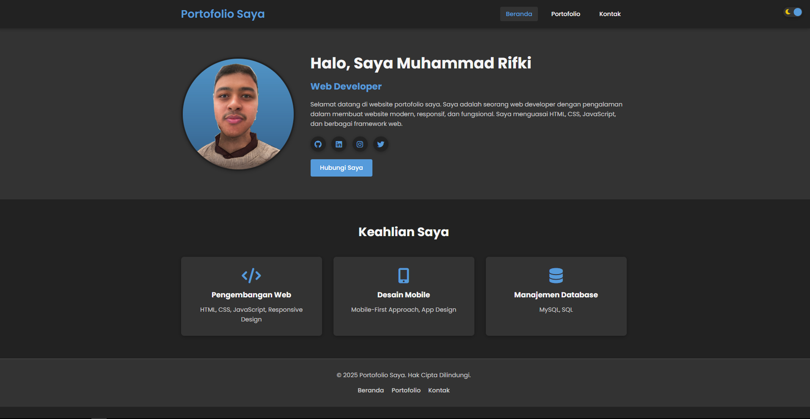
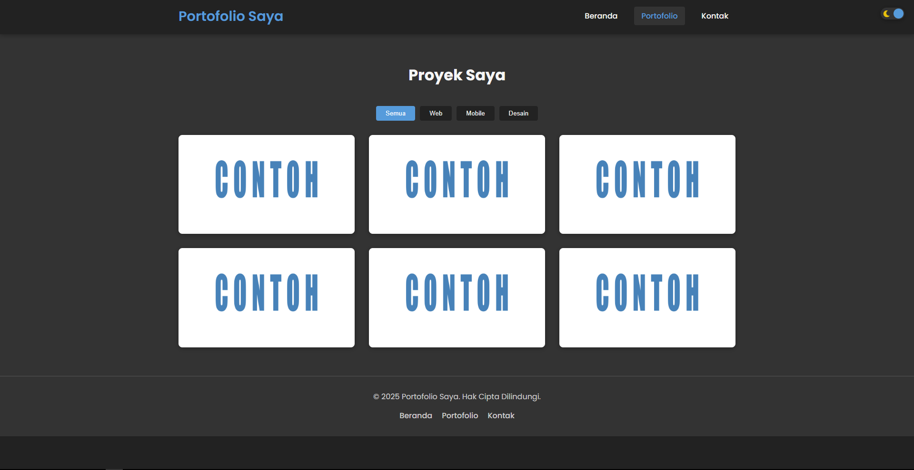
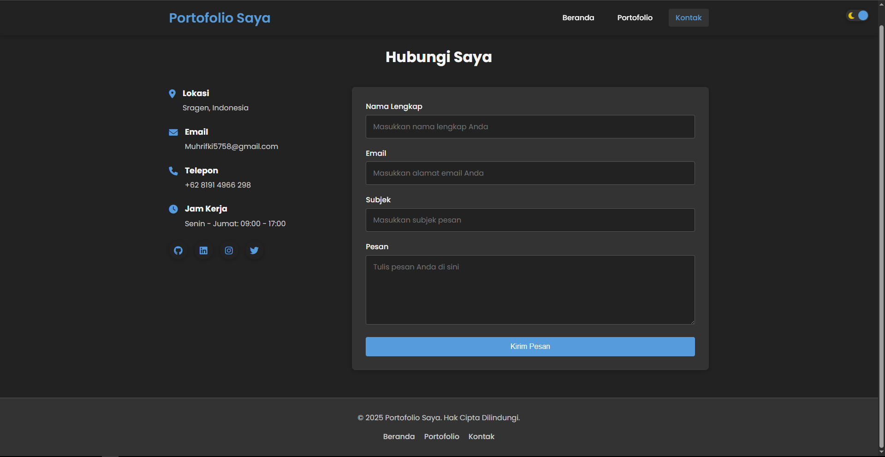

# Laporan Proyek Website Portofolio

## Informasi Proyek
- **Nama Proyek**: Website Portofolio Personal
- **Tanggal Pembuatan**: 19 Maret 2025
- **Kategori**: Pengembangan Web

## Deskripsi Proyek
Proyek ini merupakan pengembangan website portofolio personal yang dirancang untuk menampilkan informasi profil, keahlian, karya, dan informasi kontak. Website ini dibangun dengan teknologi front-end dasar yang meliputi HTML, CSS, dan JavaScript. Tujuan utama dari website ini adalah sebagai sarana presentasi diri secara profesional dalam format digital yang dapat diakses secara online.

## Struktur Direktori
```
📁 portfolio-website/
├── 📄 index.html         # Halaman utama website
├── 📄 portfolio.html     # Halaman portofolio/karya
├── 📄 contact.html       # Halaman formulir kontak
├── 📄 style.css          # File CSS untuk styling seluruh website
├── 📄 script.js          # File JavaScript untuk interaktivitas 
└── 📁 Assets             # Assets gambar untuk keperluan website 
     ├── 📄 Rifkick.jpg
     └── 📄 Contoh.jpg

```

## Fitur Website
1. **Desain Responsif**:
   - Website dioptimalkan untuk berbagai ukuran layar (desktop, tablet, mobile)
   - Menggunakan pendekatan mobile-first dengan media queries
   - Tata letak yang menyesuaikan dengan perangkat

2. **Mode Gelap (Dark Mode)**:
   - Toggle untuk beralih antara tema terang dan gelap
   - Penyimpanan preferensi tema pengguna

3. **Halaman Utama (Home)**:
   - Bagian hero dengan foto profil dan informasi singkat
   - Bagian keahlian dengan tampilan card
   - Tautan ke media sosial

4. **Halaman Portofolio**:
   - Filter proyek berdasarkan kategori (Web, Mobile, Desain)
   - Tampilan grid untuk proyek-proyek
   - Overlay informasi pada hover

5. **Halaman Kontak**:
   - Formulir kontak untuk pengunjung
   - Informasi kontak personal
   - Tautan media sosial

## Teknologi yang Digunakan
- **HTML**: Struktur halaman web
- **CSS**: Styling dan animasi
  - Penggunaan variabel CSS untuk manajemen warna
  - Flexbox dan Grid untuk layout
  - Transisi dan transformasi untuk efek visual
- **JavaScript**: untuk nteraktivitas
  - Untuk Toggle dark mode
  - Untuk Filter portofolio
- **Font Awesome**: Ikon untuk UI
- **Google Fonts (Poppins)**: Tipografi website

## Implementasi Kode

### HTML
Struktur HTML mengikuti pendekatan semantik dengan penggunaan tag-tag seperti `<header>`, `<main>`, `<section>`, dan `<footer>`. Struktur ini membantu dalam SEO dan aksesibilitas website.

```html
<!-- Contoh struktur HTML dari index.html -->
<header>
    <div class="container">
        <h1>Portofolio Saya</h1>
        <nav>
            <ul>
                <li><a href="index.html" class="active">Beranda</a></li>
                <li><a href="portfolio.html">Portofolio</a></li>
                <li><a href="contact.html">Kontak</a></li>
            </ul>
        </nav>
    </div>
</header>
```
```html
<!-- Contoh struktur HTML dari contact.html --> 
        <section class="contact-section">
            <div class="container">
                <h2>Hubungi Saya</h2>
                <div class="contact-container">
                    <div class="contact-info">
                        <div class="info-item">
                            <i class="fas fa-map-marker-alt"></i>
                            <div>
                                <h3>Lokasi</h3>
                                <p>Jakarta, Indonesia</p>
                            </div>
                        </div>
                        <div class="info-item">
                            <i class="fas fa-envelope"></i>
                            <div>
                                <h3>Email</h3>
                                <p>email@contoh.com</p>
                            </div>
                        </div>
                        <div class="info-item">
                            <i class="fas fa-phone"></i>
                            <div>
                                <h3>Telepon</h3>
                                <p>+62 812 3456 7890</p>
                            </div>
                        </div>
                        <div class="info-item">
                            <i class="fas fa-clock"></i>
                            <div>
                                <h3>Jam Kerja</h3>
                                <p>Senin - Jumat: 09:00 - 17:00</p>
                            </div>
                        </div>
                        <div class="social-icons">
                            <a href="#" class="social-icon"><i class="fab fa-github"></i></a>
                            <a href="#" class="social-icon"><i class="fab fa-linkedin"></i></a>
                            <a href="#" class="social-icon"><i class="fab fa-instagram"></i></a>
                            <a href="#" class="social-icon"><i class="fab fa-twitter"></i></a>
                        </div>
                    </div>                    
```

```html
<!--Contoh Struktur HTML dari portofolio.html-->
        <section class="portfolio-section">
            <div class="container">
                <h2>Proyek Saya</h2>
                <div class="portfolio-filter">
                    <button class="filter-btn active" data-filter="all">Semua</button>
                    <button class="filter-btn" data-filter="web">Web</button>
                    <button class="filter-btn" data-filter="mobile">Mobile</button>
                    <button class="filter-btn" data-filter="design">Desain</button>
                </div>
                
                <div class="portfolio-grid">
                    <div class="portfolio-item" data-category="web">
                        <div class="portfolio-image">
                            
                            <div class="portfolio-overlay">
                                <div class="portfolio-info">
                                    <h3>Toko Online</h3>
                                    <p>Website E-commerce</p>
                                    <a href="#" class="btn">Lihat Detail</a>
                                </div>
                            </div>
                        </div>
                    </div>
```
### CSS
Styling menggunakan pendekatan modular dengan variabel CSS untuk konsistensi warna dan efek. Penggunaan media queries untuk responsivitas pada berbagai ukuran layar.

```css
/* Contoh penggunaan variabel CSS untuk tema */
:root {
    --primary-color: #3498db;
    --secondary-color: #2980b9;
    --accent-color: #e74c3c;
    --text-color: #333;
    --bg-color: #fff;
    
}

/* Variabel untuk dark mode */
.dark-mode {
    --text-color: #f5f5f5;
    --bg-color: #222;
    
}
```

### JavaScript
JavaScript digunakan untuk menambahkan interaktivitas seperti toggle dark mode dan filter portofolio. Script dipisahkan dalam file tersendiri untuk kemudahan pemeliharaan.

```javascript
// Contoh kode JavaScript untuk toggle dark mode (diperkirakan)
const darkModeToggle = document.getElementById('dark-mode-toggle');

// Cek preferensi tema sebelumnya
if (localStorage.getItem('darkMode') === 'enabled') {
    document.body.classList.add('dark-mode');
    darkModeToggle.checked = true;
}

// Toggle dark mode
darkModeToggle.addEventListener('change', () => {
    if (darkModeToggle.checked) {
        document.body.classList.add('dark-mode');
        localStorage.setItem('darkMode', 'enabled');
    } else {
        document.body.classList.remove('dark-mode');
        localStorage.setItem('darkMode', 'disabled');
    }
});
```
## Kesimpulan
Website portofolio personal telah berhasil dikembangkan dengan mengimplementasikan berbagai fitur modern seperti dark mode, desain responsif, dan filter portofolio. Proyek ini menerapkan best practices dalam pengembangan web front-end, dengan struktur kode yang rapi dan terorganisir.

Beberapa area untuk pengembangan lebih lanjut di masa depan:
1. Penambahan animasi dan transisi yang lebih kompleks
2. Integrasi dengan CMS untuk kemudahan pembaruan konten
3. Implementasi backend untuk formulir kontak yang fungsional
4. Optimasi SEO yang lebih mendalam

## Screenshot





## Tautan Repository
GitHub Classroom: [URL Repository GitHub Classroom]

